```mermaid
graph LR
    A[Current Skills] --> B[Advanced ML/DL]
    B --> C[MLOps & Deployment]
    C --> D[Big Data Technologies]
    D --> E[Cloud Architecture]
    E --> F[AI Product Management]
    
    style A fill:#FF6B6B,stroke:#fff,stroke-width:2px
    style B fill:#4C8EDA,stroke:#fff,stroke-width:2px
    style C fill:#50C878,stroke:#fff,stroke-width:2px
    style D fill:#FFD700,stroke:#fff,stroke-width:2px
    style E fill:#9370DB,stroke:#fff,stroke-width:2px
    style F fill:#FF69B4,stroke:#fff,stroke-width:2px
```
  
  <!-- Animated Wave -->
  
  
  <!-- Typing Animation -->
  
  
  <!-- Social Badges -->
  

    
    
    
    
  

  
  <!-- Profile Views & Followers -->
  

    
    
  

---

##  About Me

🎓 **Computer Science Student** at MIT ADT University (2021-2025)  
📊 **Data Analytics Specialist** with expertise in ML & Business Intelligence  
🚀 **95% Accuracy** achieved in AI predictive models  
💼 **3+ Professional Internships** in Data Analysis & AI Development  
🏆 **7+ Industry Certifications** from Google, Microsoft, IBM & AWS  
📈 **60% Business Growth** delivered through data-driven insights  

### 🎯 Current Focus
- 🔬 Developing AI-powered financial risk analytics systems
- 📊 Creating interactive business intelligence dashboards
- 🤖 Building machine learning models for healthcare predictions
- 📈 Optimizing data pipelines for real-time analytics

---

## 🛠️ Tech Stack & Skills

### 💻 Programming & Analytics

### 📊 Data Visualization & BI Tools

### 🤖 Machine Learning & AI

### ☁️ Cloud Platforms

### 🛠️ Tools & Technologies

---

## 🏆 Certifications Wall

  <table>
    <tr>
      <td align="center">
         
        <b>Data Analytics</b> 
        Nov 2024
      </td>
      <td align="center">
         
        <b>Advanced Data Analytics</b> 
        Mar 2025
      </td>
      <td align="center">
         
        <b>Business Intelligence</b> 
        Apr 2025
      </td>
      <td align="center">
         
        <b>Data Analysis & Viz</b> 
        Nov 2024
      </td>
    </tr>
    <tr>
      <td align="center">
         
        <b>Cloud Foundations</b> 
        Apr 2024
      </td>
      <td align="center">
         
        <b>Azure Fundamentals</b> 
        Jan 2025
      </td>
      <td align="center">
         
        <b>Azure AI Fundamentals</b> 
        Jan 2025
      </td>
      <td align="center">
         
        <b>Coming Soon</b> 
        2025
      </td>
    </tr>
  </table>

---

## 💼 Professional Experience

<b>🏢 Virtual Intern - Tata IQ, Forage</b> (Aug 2025) <i>(Click to expand)</i>

- 🤖 Developed **AI-Driven Financial Risk Analytics** using GenAI tools
- 📊 Created high-performance predictive model with **95% accuracy** for delinquency prediction
- 🔒 Designed scalable AI-powered collections strategy with regulatory compliance
- 📈 Pioneered no-code GenAI model for identifying delinquent accounts

<b>🏥 Data Analyst Intern - MedTourEasy</b> (Mar - May 2025) <i>(Click to expand)</i>

- 📊 Analyzed patient trends and treatment preferences using Python, Tableau, Power BI, and SQL
- ⚡ **Improved internal reporting efficiency by 40%**
- 📈 Delivered interactive dashboards for cross-functional teams
- 🎯 Enhanced data-driven planning and strategic decision-making

<b>📊 Virtual Intern - Tata, Forage</b> (Jun 2025) <i>(Click to expand)</i>

- 📊 Created data visualizations for Tata Consultancy Services
- 👔 Prepared executive-level presentations for client senior leadership
- 📈 Enhanced decision-making capabilities through effective data analysis

---

## 🚀 Featured Projects

  
| Project | Description | Tech Stack | Impact |
|---------|-------------|------------|--------|
| **📈 Stock Market Dashboard** | Analyzed 3 years of Apple stock data with advanced charting and forecasting |   | **30%** better investment decisions |
| **🛒 Supermarket Analysis** | Customer behavior analysis with interactive Power BI dashboards |   | **60%** improved business decisions |
| **🏥 Diabetes Prediction System** | ML-based prediction system with Flask backend and Tkinter GUI |    | Early diabetes detection |

---

## 📊 GitHub Analytics

  
  

  

  

---

## 📈 Contribution Graph

  

---

## 🎯 Current Goals & Learning Path

  

### 🎓 Currently Learning
- 🧠 Deep Learning & Neural Networks
- 📊 Advanced Statistical Modeling
- 🔄 Real-time Data Processing
- 🏗️ Data Engineering & ETL Pipelines
- 🎨 Advanced Data Visualization Techniques

---

## 🤝 Let's Connect & Collaborate!

  
  
  
  ### 💭 Open for Opportunities in:
  
  **Data Analytics** • **Machine Learning** • **Business Intelligence** • **AI Development**
  
   
  
  📧 **Email:** uchasha.mukherjee25@gmail.com  
  📱 **Phone:** +91 7385385016  
  🌐 **Location:** Mumbai, India  
  💼 **LinkedIn:** [/in/uchasha-mukherjee](https://linkedin.com/in/uchasha-mukherjee)
  
   
  
  
  
  ### 💡 *"Turning data into insights, one analysis at a time"* ✨
  

---

  

